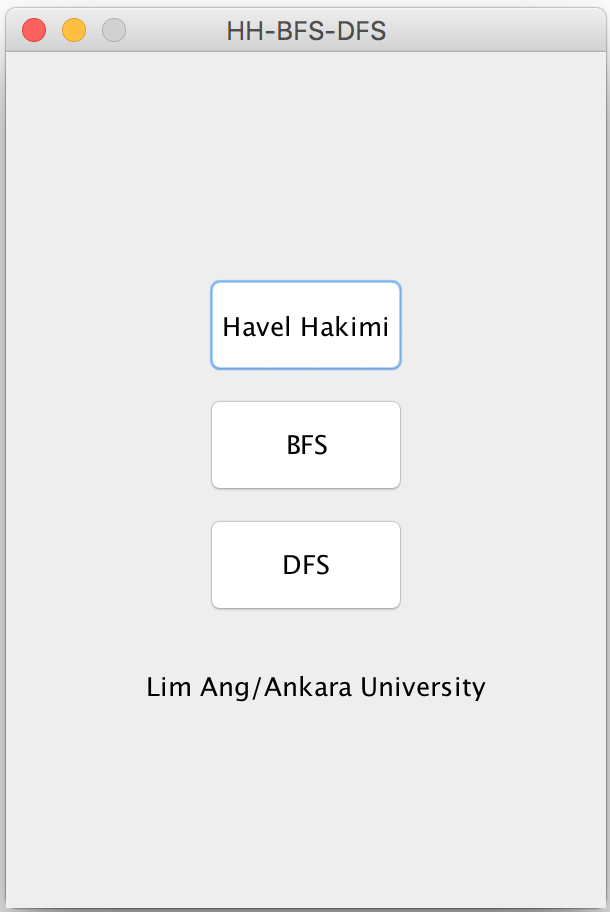
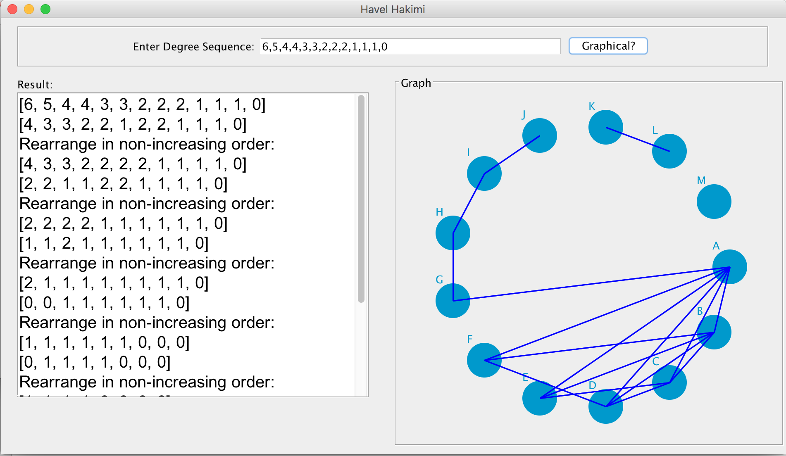
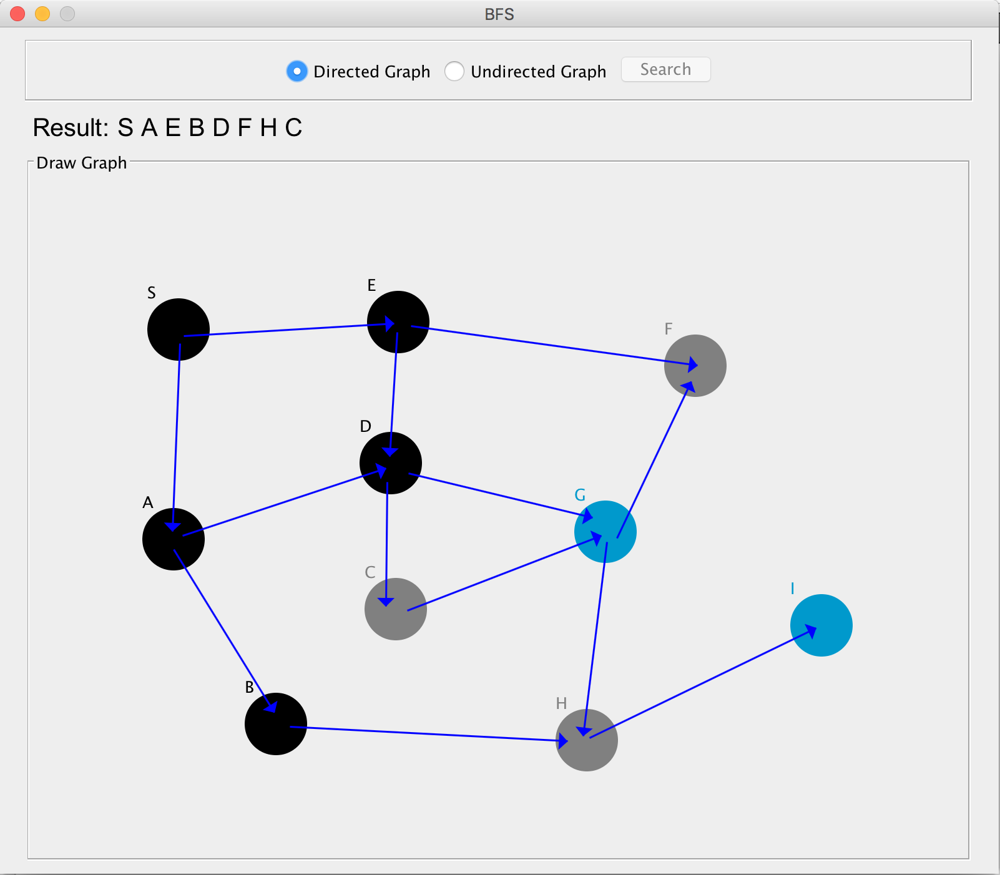
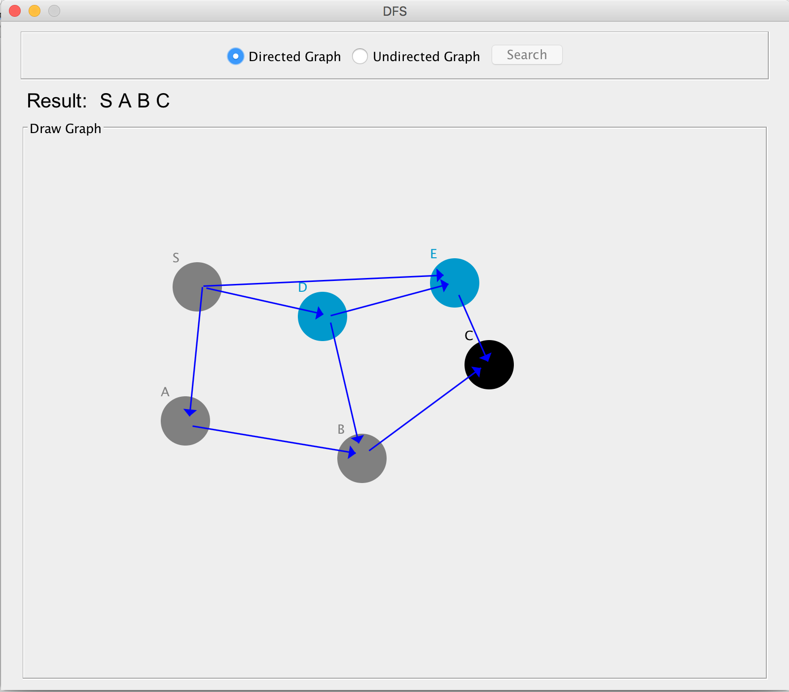

# DFS, BFS, and Havel-Hakimi Algorithms

#### Homework (Ankara University (2015-2016)).
I wrote this program in Java which contains 3 algorithms, DFS, BFS and Havalhakimi. DFS/BFS can generate dynamic nodes and contains animated searching process. HavelHakimi takes a degree sequence, produces step-by-step calculation and corresponding graph based on the specified degree sequence.

## Main Interface

## Havel Hakimi Algorithm

## DFS Algorithm

## BFS Algorithm

